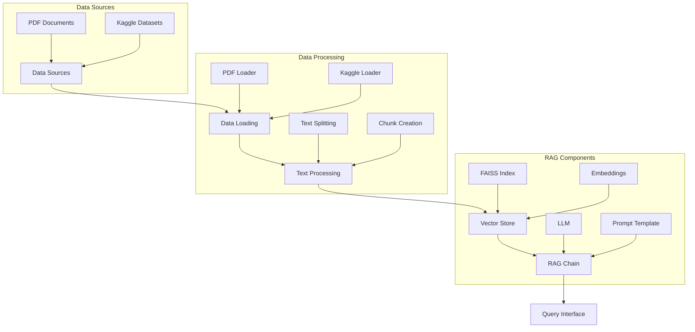
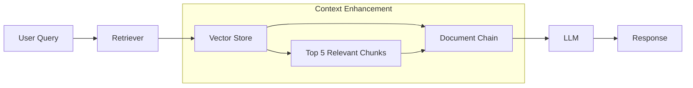
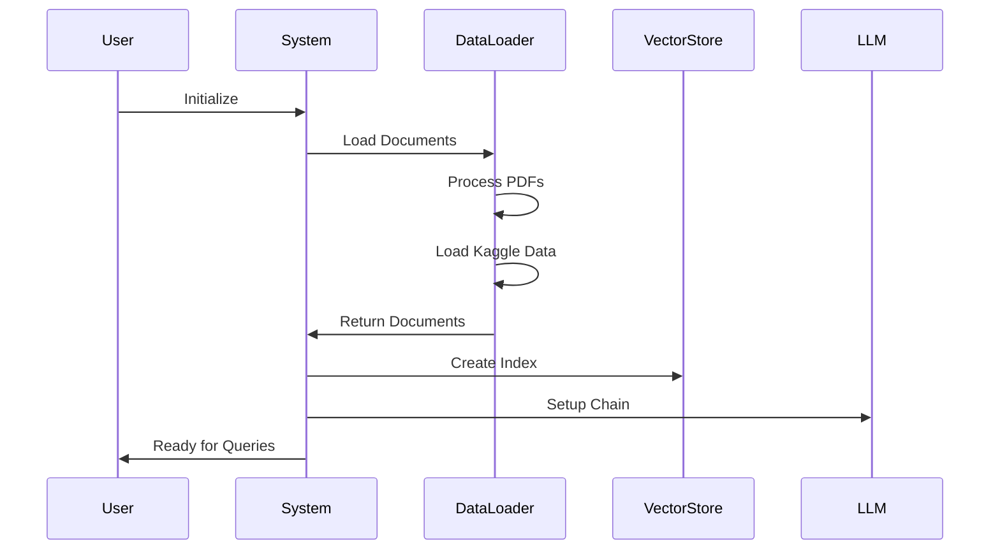
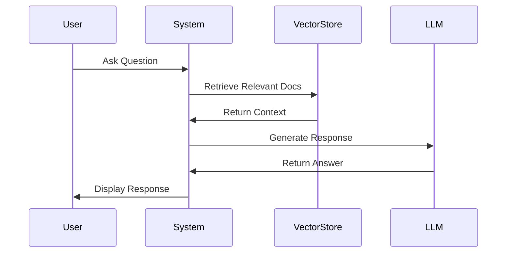

Check out the configuration reference at https://huggingface.co/docs/hub/spaces-config-reference

# Construction Domain RAG System

A Retrieval-Augmented Generation (RAG) system specialized for the construction industry, capable of answering queries about construction safety, project management, and regulations.

## System Architecture



## Core Components

### 1. Data Loading (`ConstructionDataLoader`)
- Handles multiple data sources:
  - PDF documents (construction codes, safety guidelines)
  - Kaggle datasets (project management data)
- Implements flexible loading mechanisms for each data type
- Manages temporary storage for downloaded datasets

### 2. RAG System (`ConstructionRAG`)



## Key Libraries Used

| Library | Purpose | Usage |
|---------|---------|-------|
| `langchain` | RAG Framework | Core RAG functionality, chains, and document processing |
| `langchain_openai` | OpenAI Integration | LLM and embeddings integration |
| `FAISS` | Vector Store | Efficient similarity search for document retrieval |
| `PyPDF` | PDF Processing | Loading and parsing PDF documents |
| `pandas` | Data Processing | Processing structured data from Kaggle |
| `kaggle` | Data Source | Accessing Kaggle datasets |
| `python-dotenv` | Configuration | Managing environment variables |
| `gradio` | UI Interface | Web interface for the RAG system |

## System Flow

1. **Initialization**


2. **Query Processing**


## Environment Setup

Required environment variables:
- `OPENAI_API_KEY`: OpenAI API authentication
- Kaggle credentials (for dataset access)

## Directory Structure
```
construction-rag/
├── main.py              # Core RAG implementation
├── app.py              # Gradio interface
├── requirements.txt     # Dependencies
├── construction_data/   # PDF documents
└── temp_kaggle_data/   # Temporary dataset storage
```

## Features
- Context-aware responses using RAG
- Multiple data source integration
- Structured response format
- Source attribution in answers
- Inference capabilities with transparency

## Query Examples
The system can handle queries about:
# What are the best practices for managing construction site safety?
# What are the minimum requirements for stairway construction in residential buildings?
# What are the fall protection requirements for construction workers?
# What are the emergency exit requirements for residential buildings? - no answer!
# What are the key safety measures required when working at heights?
# What are the common causes of construction project delays?
# What is the average duration of residential construction projects?
# How do material costs typically impact construction project budgets? - Inference
# What are the most common risk factors in construction project management?
# What is the relationship between project size and completion time?
# What are the fall protection requirements for construction workers?
# What are the best practices for managing construction site safety?
# How have construction costs changed over recent years? - no answer!
# What are the most important factors to consider in construction project planning?
# What are common quality control measures in construction projects?
# What documentation is required for construction project compliance?
